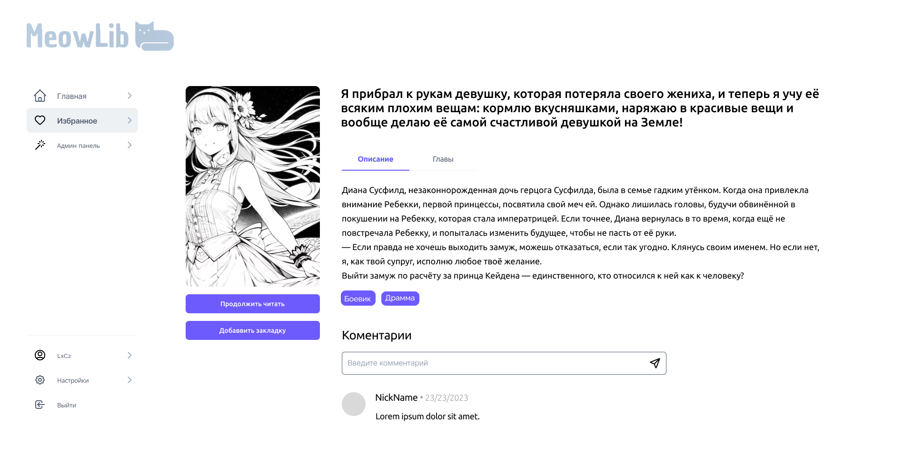

## MeowLib.Frontend

Для запуска проекта в режиме разработке используйте:

```bash
npm run dev
# or
yarn dev
# or
pnpm dev
# or
bun dev
```

После запуска откройте [http://localhost:3000](http://localhost:3000) с помощью вашего браузера.

Проект был написан с целью получения опыта в написании больших проектов и работы в команде. Во время написания использовались следующие технологии:

-   Frontend:

    -   Next.JS
    -   TypeScript
    -   React
    -   и много других библиотек для удобного написания

-   Backend:
    -   .NET 8
    -   Asp NET
    -   Entity Framework
    -   LINQ
    -   Для базы данных Sqlite

Проект имеет следующую архитектуру (Frontend):

-   /src - корневая папка исходного кода.
    -   /app - корень приложения, отсюда так или иначе будет вызвана вся его логика. Роутинг будет где-нибудь здесь.
    -   /pages - здесь будут находиться все страницы как компоненты, расположение файлов здесь не влияет на роутинг приложения. Роутинг будет настроен в 'app'.
        -   /{CompoentNamePage} - в 'pages' будут находиться компоненты страниц. Каждый компонент страницы находится в своей директории с названием формата: '{ComponentName}Page'. В директории будут находится файлы: '{ComponentName}Page.tsx' и '{ComponentName}Page.module.css'.
            -   /ui - Если на странице используется какой-нибудь компонент он помещается сюда, исключая те компоненты, которые используются 2 и более страницами.
    -   /entities - Сущности приложения и логика работы с ним. Подробнее в подпапках.
        -   /{EntityName} - Отдельная сущность в приложении. В ней находиться: '{EntityName}.ts'. Файл с доменной моделью данной сущности.
        -   /models - Набор моделей связанный с сущностью.
            -   /request - Набор моделей запросов к API заданной сущности.
            -   /responses - Набор ответов на запросы к API заданной сущности.
            -   /dto - Набор DTO моделей для заданной сущности.
        -   /api - Набор методов реализовывающих запросы на API. Представлен файлом: '{EntityName}Api.tsx'
        -   /services - Набор методов бизнес-логики, который может использовать '/api' методы для взаимодействия с API. Или другие сервисы. Вызов отсюда '/api' другой сущности некорректен
    -   /shared - Различные вещи, которые могут использоваться везде. Например: UI-kit
        -   /ui - Набор компонентов для повсеместного использования. UI-kit.
        -   /models - Набор моделей для повсеместного использования
            -   /responses - Набор переиспользуемых моделей ответов от API. Сюда следует поместить 'IValidationErrorResponse' и 'IBaseErrorResponse'

Мы главные конкуренты для [RanobeLib](https://ranobelib.me/).



> Псс... для запуска нужен backend. Его можно найти [тут](https://github.com/ProjectMeowInc/MeowLib.Backend).
